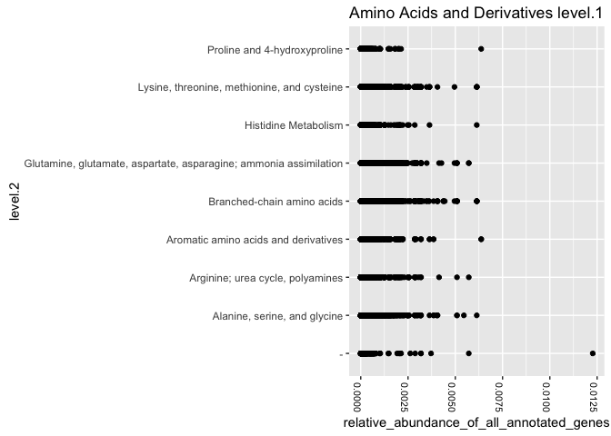
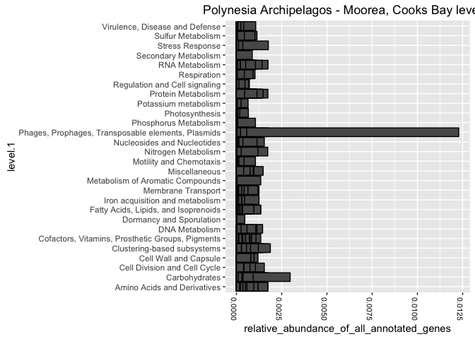

For beginners in R: A tutorial on generating MG-Rast metagenome plots
================
Hannah Woo (University of Tennessee)
May 12, 2016

*This tutorial is meant to give new R users a short introduction in data frame manipulation and plotting using ggplot2.*

Description
-----------

MG-RAST (<http://metagenomics.anl.gov>) is a widely used annotation pipeline for next-generation sequencing data. Annotation results tend to be very large tables of function or taxa abundances. With thousands of functions or taxa to consider, a set of metagenomes can have an overwhelming amount of information. This Rmarkdown tutorial will describe how to create a series of plots from abundance tables as an initial visualization. The goal is to view the dataset quickly and conveniently in one pdf. Results could be included as supplementary material for publication.

Functional Data
---------------

This tutorial uses the publicly available Global Ocean Survey (GOS) dataset (<http://www.jcvi.org/cms/research/projects/gos/overview>). Many different types of annotations are available on MG-RAST but we will focus on just the SEED Subsystems database annotation-- a curated hierarchical categorization of function with 3 nested levels.

Below is the overview of the data object given by **str**. There are 28 different functional groupings at Level 1. Level 2 and 3 functional groupings are nested within each other and become more numerous and specific. At the finest level of resolution, we have 8343 different functions. MG-Rast provides abundance information for multiple metagenome as rows. As a result, the data table is typically very long with just a few columns. For this tutorial, we will consider the categories and abundance columns. We will ignore some of the other ones like avg.evalue, avg.identity, avg align length, hits. This overview is helpful because the dimensions of the data frame, the data types of the columns, and some of the histogram information for the factors.

``` r
data_subsystems_gos<-read.delim(
  'data/table_subsystemsMGRAST_GOS.tsv', 
  header = TRUE, 
  sep = "\t", 
  quote = "", 
  dec = ".", 
)

str(data_subsystems_gos)
```

    ## 'data.frame':    301077 obs. of  11 variables:
    ##  $ metagenome   : num  4441615 4441605 4441603 4441156 4441617 ...
    ##  $ level.1      : Factor w/ 28 levels "Amino Acids and Derivatives",..: 1 1 1 1 1 1 1 1 1 1 ...
    ##  $ level.2      : Factor w/ 168 levels "-","ABC transporters",..: 1 1 1 1 1 1 1 1 1 1 ...
    ##  $ level.3      : Factor w/ 1148 levels "(GlcNAc)2 Catabolic Operon",..: 358 358 358 358 358 358 358 358 358 358 ...
    ##  $ function.    : Factor w/ 8343 levels "(3R)-hydroxymyristoyl-[ACP] dehydratase (EC 4.2.1.-)",..: 1673 1673 1673 1673 1673 1673 1673 1673 1673 1673 ...
    ##  $ abundance    : int  32 4 3 8 29 20 38 22 54 8 ...
    ##  $ avg.eValue   : num  -47.5 -56.7 -49.3 -83.4 -44.5 ...
    ##  $ avg...ident  : num  75.1 72.8 72 87 73 ...
    ##  $ avg.align.len: num  116 141 124 168 114 ...
    ##  $ X..hits      : int  13 2 3 1 13 9 12 3 14 4 ...
    ##  $ X            : logi  NA NA NA NA NA NA ...

Metadata
--------

MG-RAST has metadata available for all their metagenomes. The level of detail with the metadata is specific to the person who generated the data. From the overview of the metadata object, we see columns for biome, feature, country, coordinates, etc. There is a plethora of data to visualize. We will just use location in this tutorial.

Both the abundance table and metadata files are included in the source under the 'data' folder.

``` r
metadata<-read.delim(
  'data/metadata_MGRAST_GOS.tsv', 
  header = TRUE, 
  sep = "\t", 
  quote = "", 
  dec = ".", 
  )

str(metadata)
```

    ## 'data.frame':    78 obs. of  12 variables:
    ##  $ MG.RAST.ID     : num  4441662 4441576 4441148 4441126 4441121 ...
    ##  $ Metagenome.Name: Factor w/ 75 levels "GS000a Shotgun - Open Ocean - Sargasso Sea - Sargasso Station 11 - Bermuda",..: 34 6 66 43 52 25 75 51 3 71 ...
    ##  $ bp.Count       : Factor w/ 75 levels "100,097,831",..: 37 21 44 62 63 32 6 75 33 41 ...
    ##  $ Sequence.Count : Factor w/ 74 levels "101,558","102,708",..: 34 25 40 58 62 30 6 72 31 39 ...
    ##  $ Biome          : Factor w/ 2 levels "freshwater habitat",..: 2 2 2 2 2 1 2 2 2 2 ...
    ##  $ Feature        : Factor w/ 2 levels "freshwater habitat",..: 2 2 2 2 2 1 2 2 2 2 ...
    ##  $ Material       : Factor w/ 2 levels "freshwater habitat",..: 2 2 2 2 2 1 2 2 2 2 ...
    ##  $ Location       : Factor w/ 52 levels "Bay of Fundy, Nova Scotia",..: 20 47 32 48 45 34 11 43 47 30 ...
    ##  $ Country        : Factor w/ 13 levels " ","Australia",..: 6 3 11 1 7 10 13 7 3 1 ...
    ##  $ Coordinates    : Factor w/ 68 levels "-.02083, -91.1978",..: 37 48 22 25 11 68 52 12 47 19 ...
    ##  $ Sequence.Type  : Factor w/ 2 levels "MT","WGS": 2 2 2 2 2 2 2 2 1 2 ...
    ##  $ Sequence.Method: Factor w/ 1 level "other": 1 1 1 1 1 1 1 1 1 1 ...

Reading in the abundance data
-----------------------------

I've created a function to read in the subsystems annotation data as a tab delimited file. The function **data\_readin\_mgrast** just needs to know path to the data file in quotes. Having this script as a function will make life easier in the long-run. If we wanted to change the data file, we can change the path of the file in the function call and modify the output quickly.

The role of the **colClasses** may not be obvious. By using **colClasses** we are explicitly assigning data types to each column. Common datatypes are factors, integers and numbers. I can use 'NULL' to ignore some of the columns and speed up the parsing. The second part of the function converts abundance into a proportions of total genes for each metagenome.

``` r
data_readin_mgrast<-function(filename){
  require(plyr)
data_subsystems_gos<-read.delim(
  filename, 
  header = TRUE, 
  sep = "\t", 
  quote = "", 
  dec = ".", 
  colClasses=c("factor","factor","factor","factor","factor","integer","NULL","NULL","NULL","NULL","NULL"))
  
#transform original data into proportions for plotting
data_subsystems_gos<-ddply(
  data_subsystems_gos, 
  c("metagenome"), 
  transform, 
  relative_abundance_of_all_annotated_genes = (abundance / sum(abundance)))
}
```

Reading in the metadata
-----------------------

Read in metadata text file. Pick one metadata category to plot against the genes' relative abundances. Add that category onto the large data table as a new column. One of the most informative features in this example is the sampling location for each metagenome.

This function is more complicated. We must specify 3 pieces of information for this function: 1) the name of the data object from the **data\_readin\_mgrast** function, 2) the path to the metadata file, and 3) the name of the metadata column we want to plot.

``` r
#Read in the metadata for the GOS metagenomes

metadata_readin_mgrast<-function(datamatrixname,filename2, metadata.col){
  require(plyr)
metadata_gos<-read.delim(filename2, header = TRUE, sep = "\t", quote = "",
           dec = ".")
#need to make sure these are characters
mgrastid=as.character(metadata_gos$MG.RAST.ID)
columninfo=as.character(metadata_gos[[metadata.col]])
#add a new columns the abundance dataframe so that they can be identified by location 
datamatrixname$metagenome_metadatacol<-mapvalues(datamatrixname$metagenome, from =mgrastid, to = columninfo)   
return(datamatrixname)
}
```

Extract the names of the level 1 categories
-------------------------------------------

I decided to make a function to extract the names of the level 1 functional categories instead of **hard-coding** them. 'Hard-coding' in this scenario would be using a list of names. This can lead to unpredictable results in the future if the SEED Subsystems groupings ever change.

Plot the relative gene abundances for a user-specified level 1 category
-----------------------------------------------------------------------

Here is the function to produce a single plot. ggplot2 is a popular R package for plotting with lots of documentations and tutorials online (<http://docs.ggplot2.org/current/>). We are subsetting the MG-rast data to the user-specified level1 category. Then we are plotting the various level 2 categories nested within that level 1 category against the relative abundance. All other things after that geom\_point are plotting aesthetics.

``` r
proportionplotting_level1 <- function(matrixname,i) {
  require(ggplot2); 
  outputplot=ggplot(matrixname[matrixname$level.1==i,],aes(level.2,relative_abundance_of_all_annotated_genes)) + geom_point(colour="black") + theme(axis.text.x=element_text(angle=-90, size=8, colour="black")) + coord_flip() + ggtitle(paste(i,"level.1")); 
  return(outputplot)
  }
```

Plot the relative gene abundances for a user-specified metadata category
------------------------------------------------------------------------

This is very similar to the previous function but we will specify what column in the metadata to use.

``` r
proportionplotting_level1_bymetadata <- function(matrixname,metadata.col) {
  require(ggplot2); 
  outputplot=ggplot(matrixname[which(matrixname$metagenome_metadatacol ==metadata.col),],aes(level.1,relative_abundance_of_all_annotated_genes)) + geom_bar(stat="identity", position="dodge", colour="black") + theme(axis.text.x=element_text(angle=-90, size=8, colour="black"),legend.position ="top") + coord_flip() + ggtitle(paste(metadata.col,"level.1")); 
  return(outputplot)
  }
```

Call the functions:
-------------------

All the previous chunks of codes defined our functions. Now, we can use them. If I ever wanted to change the input data file or the metadata category plotted, I would only need to change the following chunk of code.

``` r
data_GOS<-data_readin_mgrast('data/table_subsystemsMGRAST_GOS.tsv')
globalocean_data_metadata<-metadata_readin_mgrast(datamatrixname = data_GOS, filename2 = 'data/metadata_MGRAST_GOS.tsv', metadata.col = "Location")
proportionlevel1_pathwaynames<-level1_extraction(globalocean_data_metadata)
proportionplotting_level1(globalocean_data_metadata,'Amino Acids and Derivatives')
```

<!-- -->

``` r
proportionplotting_level1_bymetadata(globalocean_data_metadata, 'Polynesia Archipelagos - Moorea, Cooks Bay')
```

<!-- -->

Create PDF of multiple plots
----------------------------

To exhaustively plot your metagenome dataset, use the **lapply** function. We are looping this function over all the level1 pathways in our data set. Then we are looping over all the locations from our data set. Everything will be in pdfs in our working directory.

In this demo, I have turned off the evaluation of this last chunk. The plotting can take a few minutes. To turn this chunk of code back "on", change eval=FALSE to eval=TRUE.

``` r
getwd()
pdf(file="bypathway.pdf", width=12) 
  lapply(X= proportionlevel1_pathwaynames, FUN= proportionplotting_level1, matrixname=data_subsystems_gos)
  dev.off()
  
pdf(file="bypathway_environment.pdf", width=12) 
  lapply(X = location, FUN = proportionplotting_level1_byenvironment, matrixname=data_subsystems_gos)

  dev.off()
```

FIN. Please let me know if you have questions or feedback. I'd be glad to hear from you. <hwoo@utk.edu>
