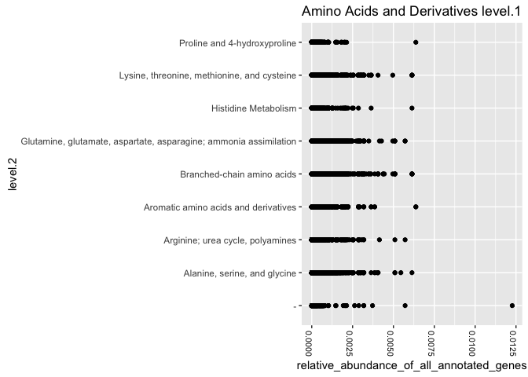

This tutorial utilized the Global Ocean Survey dataset that is publicly
available online at MG-RAST. We will utilize the SEED Subsystems
annotation of the GOS dataset. Metadata was also available publicly from
the MG-RAST site. Both files are included.

Reading in the data:
--------------------

First, we read in the subsystems annotation of the GOS dataset from
MG-RAST as a tab deliminted file. We will use classes string to parse
the category names and just the abundance information. Other columns
such as E-value will be ignored for now.

Then, we will turn all abundances into a proportions of total genes for
each genome.

As a sanity check, we find that annotated genes proportions for each
metagenome sums to 1 as expected.

    library(plyr) #for the ddply function

    #read just the category and abundance data of the Global Ocean Survey data.
    data_subsystems_gos<-read.delim(
      "data/table_subsystemsMGRAST_GOS.tsv", 
      header = TRUE, 
      sep = "\t", 
      quote = "", 
      dec = ".", 
      colClasses=c("factor","factor","factor","factor","factor","integer","NULL","NULL","NULL","NULL","NULL"))
      
    #transform original data into proportions for plotting
    data_subsystems_gos<-ddply(
      data_subsystems_gos, 
      c("metagenome"), 
      transform, 
      relative_abundance_of_all_annotated_genes = (abundance / sum(abundance)))

    #sanity check
    tapply(data_subsystems_gos$relative_abundance_of_all_annotated_genes,data_subsystems_gos$metagenome, sum)

    ## 4441121.3 4441124.3 4441125.3 4441126.3 4441127.3 4441128.3 4441129.3 
    ##         1         1         1         1         1         1         1 
    ## 4441130.3 4441131.3 4441132.3 4441133.3 4441134.3 4441135.3 4441136.3 
    ##         1         1         1         1         1         1         1 
    ## 4441139.3 4441139.4 4441143.3 4441144.3 4441145.3 4441146.3 4441147.3 
    ##         1         1         1         1         1         1         1 
    ## 4441148.3 4441149.3 4441150.3 4441151.3 4441152.3 4441153.3 4441155.3 
    ##         1         1         1         1         1         1         1 
    ## 4441156.3 4441568.3 4441570.3 4441572.3 4441573.3 4441574.3 4441575.3 
    ##         1         1         1         1         1         1         1 
    ## 4441576.3 4441578.3 4441579.3 4441580.3 4441581.3 4441582.3 4441583.3 
    ##         1         1         1         1         1         1         1 
    ## 4441584.3 4441585.3 4441586.3 4441588.3 4441589.3 4441590.3 4441591.3 
    ##         1         1         1         1         1         1         1 
    ## 4441592.3 4441593.3 4441594.3 4441595.3 4441596.3 4441596.4 4441598.3 
    ##         1         1         1         1         1         1         1 
    ## 4441599.3 4441601.3 4441602.3 4441603.3 4441604.3 4441605.3 4441606.3 
    ##         1         1         1         1         1         1         1 
    ## 4441607.3 4441608.3 4441609.3 4441610.3 4441613.3 4441614.3 4441615.3 
    ##         1         1         1         1         1         1         1 
    ## 4441616.3 4441617.3 4441618.3 4441658.3 4441659.3 4441660.3 4441661.3 
    ##         1         1         1         1         1         1         1 
    ## 4441662.3 
    ##         1

Reading in the metadata:
------------------------

Read in metadata and combine with abundance data

    #Read in the metadata for the GOS metagenomes
    metadata_gos<-read.delim("data/metadata_MGRAST_GOS.tsv", header = TRUE, sep = "\t", quote = "",
               dec = ".", colClasses=c("factor","factor","NULL","NULL","factor","factor","factor","factor","factor","NULL","factor","factor"))

    #need to make sure these are characters for the following functions to work properly
    mgrastid=as.character(metadata_gos$MG.RAST.ID)
    location=as.character(metadata_gos$Location)

    #add a new columns the abundance dataframe so that they can be identified by location 
    data_subsystems_gos$metagenomelocation<-mapvalues(data_subsystems_gos$metagenome, from =mgrastid, to = location)   

    ## The following `from` values were not present in `x`: 4441167.3, 4441587.3, 4441577.3, 4441611.3, 4441571.3, 4441600.3, 4442626.3, 4442708.3, 4442709.3, 4441597.3

    #find how many pathways have information to plot
    proportionlevel1_pathwaynames<-levels(unique(factor(data_subsystems_gos$level.1))) 

    ## Loading required package: ggplot2

    ## Warning: package 'ggplot2' was built under R version 3.2.4

<!-- -->
\#\#Define plotting functions: Define two functions so that annotation
can be plotted by the most broad category and by their environment

    #plot all the functions of each level 1 category
    proportionplotting_level1 <- function(matrixname,i) {
      require(ggplot2); 
      outputplot=ggplot(matrixname[matrixname$level.1==i,],aes(level.2,relative_abundance_of_all_annotated_genes)) + geom_point(colour="black") + theme(axis.text.x=element_text(angle=-90, size=8, colour="black")) + coord_flip() + ggtitle(paste(i,"level.1")); 
      return(outputplot)
      }

    proportionplotting_level1_byenvironment <- function(matrixname,environment) {
      require(ggplot2); 
      outputplot=ggplot(matrixname[which(matrixname$metagenomelocation==environment),],aes(level.1,relative_abundance_of_all_annotated_genes), fill=metagenometype) + geom_bar(stat="identity", position="dodge", aes(fill=metagenomelocation), colour="black") + theme(axis.text.x=element_text(angle=-90, size=8, colour="black"),legend.position ="top") + scale_fill_manual(values=c("#FFFFFF","#a9a9a9")) + coord_flip() + ggtitle(paste(environment,"level.1")); 
      return(outputplot)
      }

Output to PDF:
--------------

Create a pdf with all the plots

    library(ggplot2)

    pdf(file="bypathway.pdf", width=12) 
      lapply(X= proportionlevel1_pathwaynames, FUN= proportionplotting_level1, matrixname=data_subsystems_gos)
      dev.off()
      
    pdf(file="bypathway_environment.pdf", width=12) 
      lapply(X = location, FUN = proportionplotting_level1_byenvironment, matrixname=data_subsystems_gos)

      dev.off()
